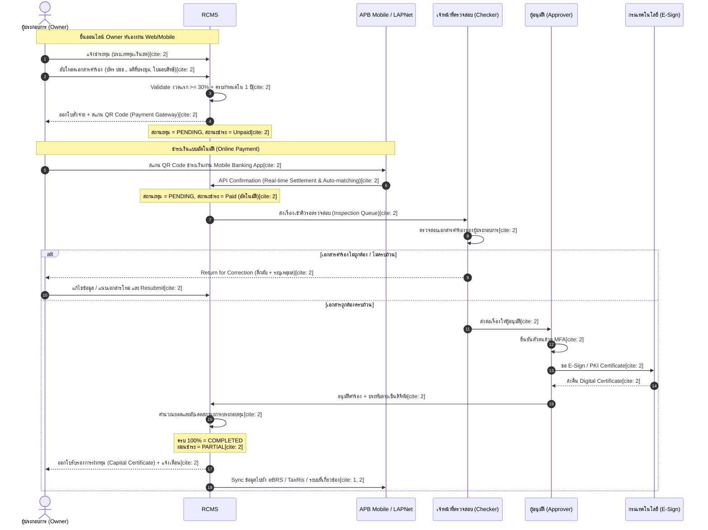
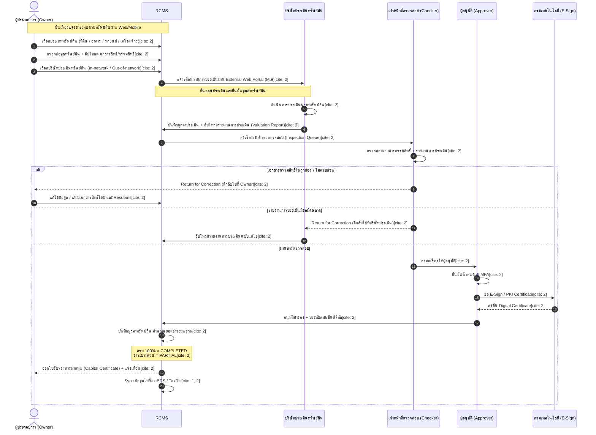
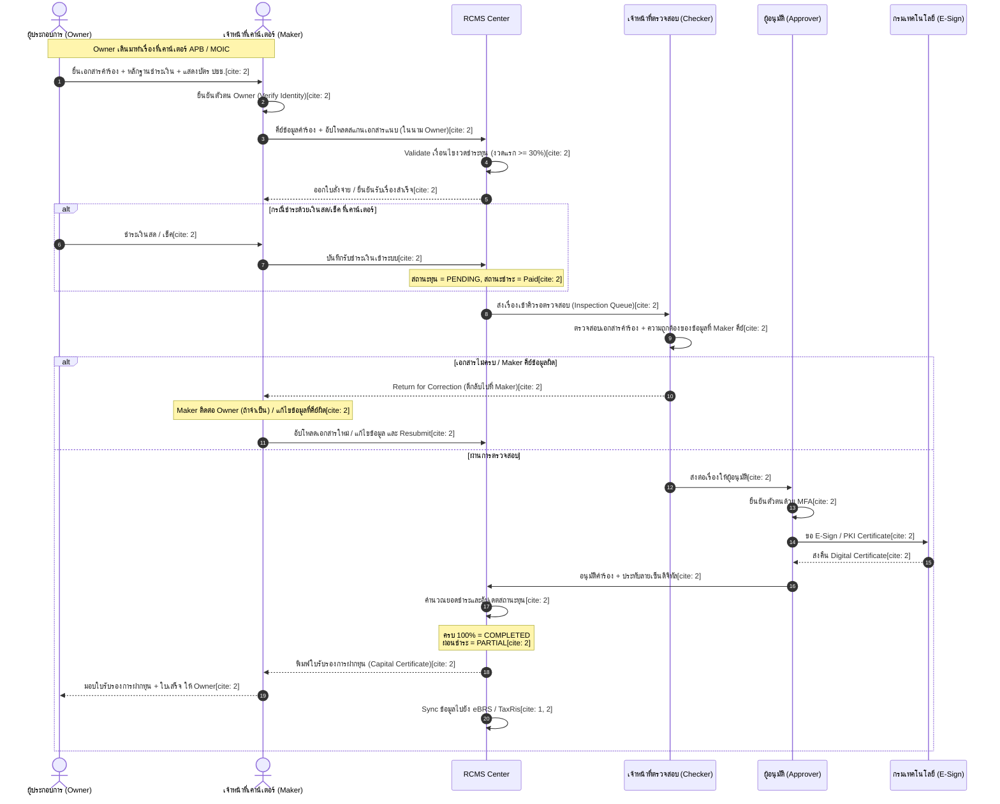
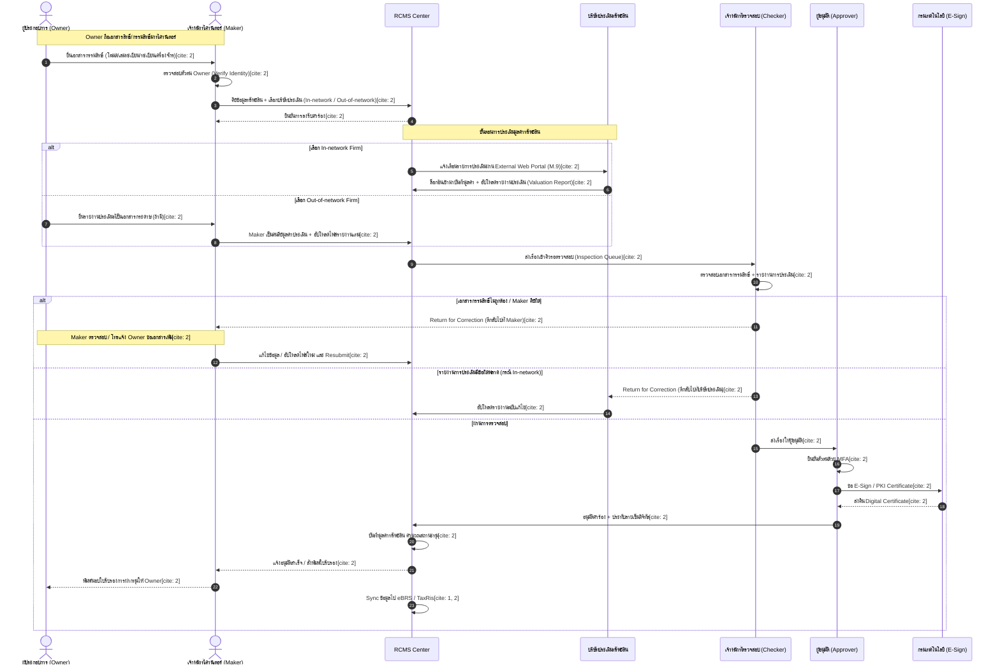
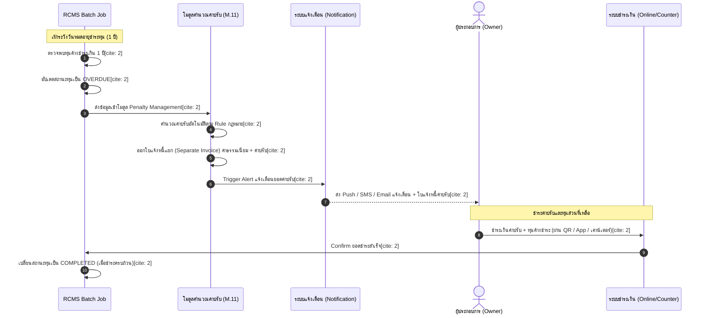

# Technical Specification: RCMS Phase 1 (Capital Monitoring Module)

## 1. System Overview

ระบบ **RCMS (Registration and Capital Monitoring System) Phase 1** มุ่งเน้นการบริหารจัดการและติดตามการประกอบทุนจดทะเบียนวิสาหกิจ (Capital Monitoring) ทั้งในรูปแบบ **ทุนเงินสด (Cash Capital)** และ **ทุนทรัพย์สิน (Asset Capital)** โดยเชื่อมต่อข้อมูลกับระบบ eBRS เดิม[cite: 1, 2] พร้อมรองรับกระบวนการตรวจสอบหลายระดับ (Approval Workflow / Four-Eyes Principle) การประทับลายเซ็นดิจิทัล (E-Sign) และการคิดค่าปรับกรณีชำระทุนเกินกำหนดเวลา (OVERDUE)

---

## 2. User Roles & Access Control (RBAC)

### 2.1 Role Definitions

1. **Owner (ผู้ประกอบการ):** ผู้ยื่นคำร้องแจ้งชำระทุนผ่าน Web / Mobile Application
2. **Maker (เจ้าหน้าที่เคาน์เตอร์ APB/MOIC):** เจ้าหน้าที่ผู้คีย์ข้อมูลคำร้องและรับชำระเงินแทน Owner ณ จุดบริการ
3. **Valuation Firm (บริษัทประเมินมูลค่าทรัพย์สิน):**
   - **In-network Firm:** มี Account ล็อกอินเข้า External Web Portal เพื่อกรอกและแนบรายงานประเมินได้เอง
   - **Out-of-network Firm:** ไม่มี Account ในระบบ (ทำรายงานกระดาษให้ Maker คีย์แทน)
4. **Checker (เจ้าหน้าที่ตรวจสอบ):** เจ้าหน้าที่ตรวจสอบความถูกต้องของคำร้อง เอกสารแนบ และหลักฐานการเงิน
5. **Approver (ผู้อนุมัติ):** ผู้มีอำนาจอนุมัติขั้นสุดท้าย และประทับลายเซ็นดิจิทัล (E-Sign)
6. **External Agencies:** หน่วยงานภายนอก (15 กระทรวง / ธนาคารกลาง / TaxRis) สำหรับค้นหาและดูรายงาน[cite: 1, 2]
7. **System Admin:** ผู้ดูแลระบบ จัดการผู้ใช้งาน, สิทธิ์ RBAC, Master Data และ Audit Logs

### 2.2 Menu Permission Matrix

| Module / Menu Item           |         Owner          |           Maker            |      Valuation Firm      |    Checker    |   Approver    | External Agencies |         Admin         |
| :--------------------------- | :--------------------: | :------------------------: | :----------------------: | :-----------: | :-----------: | :---------------: | :-------------------: |
| **Dashboard ภาพรวม**         |      View (Self)       |            View            |     View (Assigned)      |     View      |     View      |       View        |         View          |
| **Dashboard ผู้ใช้งาน**      |           -            |             -              |            -             |       -       |       -       |         -         |         View          |
| **แจ้งชำระทุน (Form Entry)** | Full (Online)[cite: 2] |  Full (Counter)[cite: 2]   |            -             |       -       |       -       |         -         |           -           |
| **คิวรายการคำร้องชำระทุน**   |           -            |        View (Self)         |            -             | Full[cite: 2] | Full[cite: 2] |         -         |           -           |
| **ติดตามสถานะการชำระทุน**    |  View (Self)[cite: 2]  |       View[cite: 2]        | View (Assigned)[cite: 2] | View[cite: 2] | View[cite: 2] |   View[cite: 2]   |     View[cite: 2]     |
| **คิวงานประเมินหลักทรัพย์**  |           -            | Full (Out-of-net)[cite: 2] |  Full (In-net)[cite: 2]  | View[cite: 2] | View[cite: 2] |         -         |           -           |
| **คำนวณและรายการค่าปรับ**    |  View (Self)[cite: 2]  |  Full (Payment)[cite: 2]   |            -             | View[cite: 2] | View[cite: 2] |         -         | Full (Rules)[cite: 2] |
| **ออกใบสั่งจ่าย / ใบเสร็จ**  |     View[cite: 2]      |       Full[cite: 2]        |            -             | View[cite: 2] | View[cite: 2] |         -         |           -           |
| **ค้นหาข้อมูลวิสาหกิจ**      |  View (Self)[cite: 2]  |       View[cite: 2]        | View (Assigned)[cite: 2] | View[cite: 2] | View[cite: 2] |   View[cite: 2]   |     View[cite: 2]     |
| **รายงานสถิติการชำระทุน**    |           -            |       View[cite: 2]        |            -             | View[cite: 2] | View[cite: 2] |   View[cite: 2]   |     View[cite: 2]     |
| **จัดการผู้ใช้งาน / RBAC**   |           -            |             -              |            -             |       -       |       -       |         -         |     Full[cite: 2]     |
| **จัดการ Master Data**       |           -            |             -              |            -             |       -       |       -       |         -         |     Full[cite: 2]     |
| **ตรวจสอบ Audit Logs**       |           -            |             -              |            -             |       -       |       -       |         -         |     View[cite: 2]     |

---

## 3. Core Business Process Workflows

### 3.1 Flow 1: Online Cash Capital (Payment Gateway)

กระบวนการยื่นแจ้งชำระทุนประเภทเงินสดผ่านช่องทางออนไลน์ โดยชำระเงินอัตโนมัติผ่าน QR Code[cite: 2]

### 3.2 Flow 2: Online Asset Capital

กระบวนการยื่นแจ้งชำระทุนประเภทหลักทรัพย์ผ่านออนไลน์ ร่วมกับบริษัทประเมินมูลค่าทรัพย์สิน[cite: 2]

### 3.3 Flow 3: Counter Service - Cash Capital

กระบวนการยื่นแจ้งชำระทุนเงินสด ณ จุดบริการเคาน์เตอร์ APB/MOIC โดย Maker[cite: 2]

### 3.4 Flow 4: Counter Service - Asset Capital

กระบวนการยื่นแจ้งชำระทุนหลักทรัพย์ ณ เคาน์เตอร์โดย Maker[cite: 2]

### 3.5 Flow 5: Overdue Penalty Handling

กระบวนการจัดการอัตโนมัติเมื่อค้างชำระทุนเกินกำหนด 1 ปี[cite: 2]

## 4. Key Data Models & Rules

### 4.1 Capital Status Rules

PENDING: ยื่นคำร้องแล้ว รอการชำระเงินหรือรอการอนุมัติ[cite: 2]
PARTIAL: ชำระทุนบางส่วน (ผ่อนชำระงวดแรก $\ge 30\%$ เรียบร้อยแล้ว)[cite: 2]
COMPLETED: ชำระทุนจดทะเบียนครบถ้วน 100%[cite: 2]
OVERDUE: เกินกำหนดชำระทุน 1 ปีนับจากวันขึ้นทะเบียน $\rightarrow$ ส่งเข้าโมดูลคำนวณค่าปรับอัตโนมัติ[cite: 2]

### 4.2 Asset Capital Categories (Collateral Master Data)

ที่ดิน (Land): โฉนด, เล่ม/หน้า/หน้าสำรวจ, เนื้อที่ (ไร่-งาน-วา), ผู้ถือครองกรรมสิทธิ์, ภาระผูกพัน
อาคาร (Building): ประเภทอาคาร, จำนวนชั้น, พื้นที่ใช้สอย ($m^2$), อายุอาคาร, ตำแหน่งที่ตั้ง
รถยนต์ (Car): เลขทะเบียน, จังหวัดที่จด, เลขตัวถัง (Chassis No.), เลขเครื่องยนต์, ยี่ห้อ/รุ่น
เครื่องจักร (Machine): ชื่อเครื่องจักร, ประเภทการวางหลักประกัน, เลขทะเบียนเครื่องจักร, ยี่ห้อ/รุ่น

## 5. UI Layout Specification: Company Detail Page

### 5.1 Top Navigation & Action Bar

Header Title: ชื่อวิสาหกิจ + เลขทะเบียนวิสาหกิจ[cite: 2]

Action Buttons: [พิมพ์ข้อมูล / ใบรับรอง][cite: 2], [แจ้งชำระทุนเพิ่ม][cite: 2]

Tab Items: ข้อมูลนิติบุคคล | ข้อมูลการประกอบทุน (Core Phase 1) | รายการหลักประกัน | ประวัติการอนุมัติ (Audit Trail)[cite: 2]

### 5.2 Card Layout Components

1. **Card: ข้อมูลนิติบุคคล:** ประเภทวิสาหกิจ, สถานะ, วันที่ขึ้นทะเบียน, ทุนจดทะเบียนรวม, เลข TaxRis[cite: 1, 2]
2. **Card: สถานะการชำระทุน:**
   **Status Badge:** COMPLETED / PARTIAL / PENDING / OVERDUE [cite: 2]
   **Progress Bar:** สัดส่วนเงินชำระแล้วเทียบกับทุนจดทะเบียนทั้งหมด
   **Countdown/Deadline:** วันหมดอายุครบกำหนด 1 ปี[cite: 2]
   **Outstanding & Penalty:** ยอดค้างชำระ และยอดค่าปรับกรณี OVERDUE[cite: 2]
3. **Card: รายการหลักประกัน (Collateral List):** ตารางแสดงรายการที่ดิน/อาคาร/รถยนต์/เครื่องจักร พร้อมลิงก์เปิดดูไฟล์รายงานประเมิน[cite: 2]
4. **Card: ประวัติรายการชำระทุน:** ตารางแสดงประวัติงวดชำระ ช่องทางชำระ สถานะ Transaction และปุ่มดาวน์โหลด E-Receipt / Capital Certificate[cite: 2]
